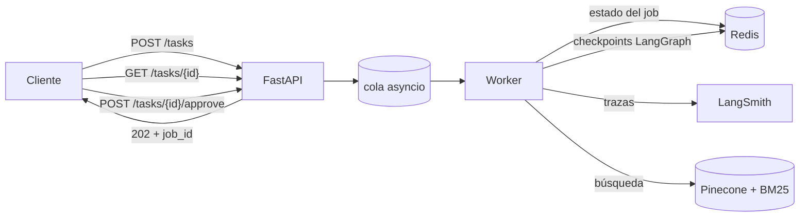
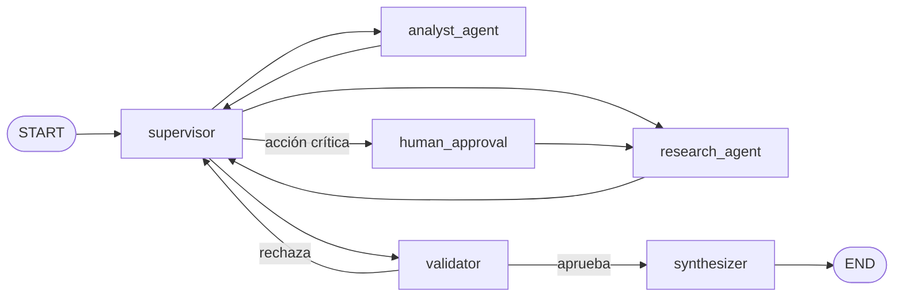

# Multi-agent RAG API

Proyecto final del curso de AI Engineering. Junta lo que fui armando en las entregas anteriores en un solo sistema: un RAG híbrido sobre un corpus de fútbol, un equipo de agentes coordinados por un supervisor, una API asíncrona con estado en Redis, una pausa para aprobación humana antes de acciones costosas, y trazas de todo en LangSmith.

La idea es que un usuario mande una pregunta compleja ("¿cuántos mundiales ganó Argentina y qué porcentaje de los que jugó?"), reciba un `job_id` al instante, y el sistema resuelva por atrás: busca evidencia en los documentos, calcula con herramientas, valida contra una rúbrica y redacta una respuesta con citas.

## Arquitectura



### El grafo de agentes



El **supervisor** mira el estado (qué evidencia hay, qué análisis hay, qué dijo el validador) y decide a quién mandar. No ejecuta nada él mismo: redacta una instrucción acotada y rutea.

El **research_agent** es un agente ReAct que solo puede buscar. Su herramienta principal es `knowledge_base_search`, que va contra el RAG. Tiene también `web_search` (Tavily), pero usarla cuesta plata y sale a internet, así que la considero una acción crítica: cuando el supervisor detecta que hace falta, el grafo se frena en `human_approval` y espera que alguien apruebe por la API. Si se rechaza, el investigador sigue solo con el corpus interno y la respuesta lo aclara en "Limitaciones".

El **analyst_agent** no puede buscar. Trabaja sobre lo que trajo el investigador con `calculator` (aritmética segura sin `eval`), `sentiment_analysis` (léxico determinista) y `validate_schema`. La separación es a propósito: si el analista pudiera traer datos nuevos, se pierde la trazabilidad de quién aportó qué.

El **validator** puntúa cuatro criterios (evidencia, cómputo, cobertura, consistencia) de 0 a 5. Aprueba solo si todos son ≥ 3, y esa regla está en código, no en el prompt: el modelo propone las notas, Python decide. Si rechaza, vuelve al supervisor con feedback concreto. Hay cortes por cantidad de pasos y de rondas de validación para que nunca quede en bucle.

El **synthesizer** arma la respuesta final combinando ambos aportes, con citas del tipo `[var_videoarbitraje.pdf p.2]`.

### RAG

Corpus de 5 documentos sobre fútbol (reglamento del fuera de juego, VAR, Copa Libertadores, formaciones tácticas, mundiales de Argentina) en tres formatos: Markdown, PDF y JSON. La ingesta los limpia, los parte en chunks de 500 tokens con overlap de 50 usando el tokenizer del modelo de embeddings, guarda `data/chunks.json` y sube los vectores a Pinecone Serverless.

La recuperación es híbrida: BM25 (léxico, sobre `chunks.json`) y búsqueda vectorial (Pinecone, embeddings `multilingual-e5-small` calculados en local), fusionados con Reciprocal Rank Fusion con pesos 0.3 / 0.7. Todo es async: el embedding de la consulta corre en un thread aparte para no bloquear el event loop y Pinecone se consulta con su cliente asíncrono.

### API y estado

`POST /tasks` valida la entrada con Pydantic, crea el job en Redis en estado `PENDING`, lo encola y responde en milisegundos. Un worker (N tareas `asyncio`, configurable) va tomando jobs y ejecutando el grafo. Los estados posibles son `PENDING → RUNNING → WAITING_APPROVAL → DONE | FAILED`. Cualquier excepción del agente se captura y el job pasa a `FAILED` con el mensaje, así el cliente nunca queda esperando para siempre.

Redis cumple dos roles separados: guarda el hash de cada job (estado, resultado, error, con TTL) y es el checkpointer de LangGraph (`AsyncRedisSaver`), lo que permite que un grafo pausado en `human_approval` se reanude aunque la API se haya reiniciado en el medio.

Todas las entradas y salidas de la API tienen modelo Pydantic, y las herramientas de los agentes también: cada tool declara su esquema de argumentos (Pydantic valida lo que genera el modelo antes de ejecutar) y devuelve un modelo serializado. Los errores de las tools vuelven como JSON con `error` y `sugerencia`, nunca como excepción, para que el agente pueda reintentar.

### Observabilidad

Con `LANGSMITH_TRACING=true` y la API key, LangChain y LangGraph mandan solos cada nodo y cada llamada al modelo. Cada ejecución del worker se envuelve en un run raíz `orchestrator_job` con el `job_id` en metadata y un tag `start` o `resume`, así en el dashboard se puede seguir un job entero incluyendo la pausa y la reanudación. Las capturas están en `screenshots/`.

## Estructura

```
app/
  main.py            FastAPI: POST /tasks · GET /tasks/{id} · POST /tasks/{id}/approve · GET /health
  worker.py          cola y consumidores asyncio, estados en Redis
  graph.py           StateGraph + checkpointer Redis
  hitl.py            nodo human_approval (interrupt)
  supervisor.py      supervisor, validador, sintetizador
  agents/            research_agent, analyst_agent, tools
  rag/               schemas, embeddings, ingest, retriever
  jobs.py            estado de jobs en Redis
  observability.py   LangSmith
  config.py          settings desde .env
  state.py           estado del grafo
data/                corpus + golden_set.json (chunks.json se genera en la ingesta)
scripts/             load_test.py (peticiones concurrentes), hitl_demo.py (flujo de aprobación)
tests/               tests offline (grafo, HITL, API, worker)
screenshots/         trazas en LangSmith
run.sh · docker-compose.yml · Dockerfile · requirements.txt · .env.example
```

## Cómo levantarlo

Hace falta Docker y cuentas gratuitas en Groq (LLM), Pinecone (vector DB) y LangSmith (trazas).

```bash
git clone https://github.com/SantiSTC/multi-agent-rag-api.git
cd multi-agent-rag-api
cp .env.example .env
# completar OPENROUTER_API_KEY (key de Groq), PINECONE_API_KEY y LANGSMITH_API_KEY
./run.sh
```

`run.sh` levanta Redis 8, corre la ingesta (crea el índice en Pinecone si no existe y sube los chunks; si ya hay vectores no los resube) y arranca la API. La primera vez tarda unos minutos porque descarga el modelo de embeddings. Termina mostrando `http://localhost:8000`; el Swagger está en `/docs`.

Sobre el LLM: la variable se llama `OPENROUTER_*` porque empecé con OpenRouter, pero es una API compatible con OpenAI y funciona con cualquier proveedor que la implemente. Terminé usando Groq porque su tier gratuito alcanza para las pruebas. Los modelos gratis tienen límite de tokens por minuto, por eso `WORKER_CONCURRENCY=1` y `LLM_MAX_TOKENS=1024` por defecto; con un proveedor pago se pueden subir.

Otros comandos: `./run.sh logs`, `./run.sh down`, `./run.sh test`.

## Cómo probarlo

```bash
# una tarea
curl -s -X POST localhost:8000/tasks -H 'content-type: application/json' \
  -d '{"task": "¿Cuándo puede intervenir el VAR y qué porcentaje de las situaciones revisables involucran goles?"}'

curl -s localhost:8000/tasks/<job_id>
```

```bash
# 5 peticiones concurrentes con polling hasta que terminen
pip install httpx
python scripts/load_test.py --n 5 --timeout 1800

# flujo de aprobación humana: la tarea pide info externa, el grafo se pausa, el script aprueba
python scripts/hitl_demo.py
python scripts/hitl_demo.py --reject
```

Los tests no usan LLM (los nodos que llaman al modelo se reemplazan por versiones fijas) pero sí necesitan un Redis accesible:

```bash
pytest
```

## Trazas

En `screenshots/`:

- `01-trazas.png`: lista de runs `orchestrator_job` del proyecto en LangSmith, con las pruebas concurrentes y las de aprobación humana.
- `02-traza-detalle.png`: una ejecución abierta: `human_approval` → `research_agent` (con sus llamadas a `knowledge_base_search`) → `supervisor` → `analyst_agent` (con `calculator`).
- `03-hitl.png`: un job pausado en `human_approval` con `interrupted: true`, esperando el `POST /tasks/{id}/approve`.

---

Autor: **Santiago Iannello**
